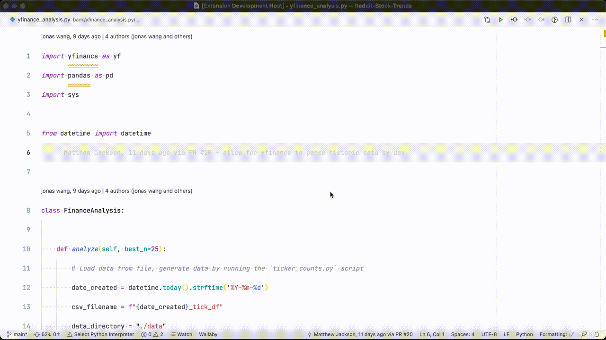

# JWT Debug Visual Studio Code Extension

Every once in a while you need to decode a jwt to look at the values within the
payload. This extension adds a `JWT Decode` command to Visual Studio Code.

